# Miaoda - 智能对话桌面应用

> 基于 Jan AI 框架二次开发的智能对话桌面应用

## 项目愿景

Miaoda 是一个基于 Jan AI 框架二次开发的智能对话桌面应用，专注于提供本地化的 AI 对话体验。项目从 Jan 框架继承了强大的 AI 推理能力，并加入了中文本地化、品牌定制和免费 AI 服务集成等特色功能。

**核心特性：**
- 🎨 品牌定制：从 Jan 完全改为 Miaoda，包含完整的中文本地化
- 🤖 免费 AI 服务：集成 grok-3 模型，通过 OpenAI 兼容 API 提供服务
- 🌍 跨平台支持：原生支持 macOS、Windows、Linux 桌面环境
- 🔧 扩展架构：灵活的桌面端和 Web 端扩展系统
- 📦 模块化设计：核心功能、Web 应用、扩展系统完全分离

## 架构总览

Miaoda 采用现代的多层架构设计，结合了 Tauri、React、TypeScript 等前沿技术：

- **桌面端架构**：Tauri (Rust) + React + TypeScript
- **包管理器**：Yarn Workspaces 管理多包架构
- **构建工具**：Vite、Rolldown
- **UI 框架**：React 19 + Radix UI + Tailwind CSS
- **路由管理**：TanStack Router
- **状态管理**：Zustand
- **国际化**：i18next + react-i18next

## 模块结构图

```mermaid
graph TD
    A["🏠 Miaoda (根)"] --> B["📦 core"];
    A --> C["🌐 web-app"];
    A --> D["🔧 extensions-web"];
    A --> E["🦀 src-tauri"];
    A --> F["🔌 extensions"];
    A --> G["📚 docs"];
    A --> H["🤖 autoqa"];
    A --> I["📝 scripts"];

    B --> B1["🧩 browser"];
    B --> B2["🔢 types"];
    B --> B3["🔧 extensions"];
    B --> B4["📋 models"];

    C --> C1["🎯 routes"];
    C --> C2["🧱 components"];
    C --> C3["📄 containers"];
    C --> C4["🎪 hooks"];
    C --> C5["🌍 services"];

    E --> E1["🔌 plugins"];
    E --> E2["🛠 utils"];
    E --> E3["📦 resources"];

    F --> F1["👤 assistant-extension"];
    F --> F2["💬 conversational-extension"];
    F --> F3["⬇️ download-extension"];
    F --> F4["🦙 llamacpp-extension"];

    click B "./core/CLAUDE.md" "查看 core 模块文档"
    click C "./web-app/CLAUDE.md" "查看 web-app 模块文档"
    click D "./extensions-web/CLAUDE.md" "查看 extensions-web 模块文档"
    click E "./src-tauri/CLAUDE.md" "查看 src-tauri 模块文档"
    click F "./extensions/CLAUDE.md" "查看 extensions 模块文档"
    click G "./docs/CLAUDE.md" "查看 docs 模块文档"
    click H "./autoqa/CLAUDE.md" "查看 autoqa 模块文档"
    click I "./scripts/CLAUDE.md" "查看 scripts 模块文档"
```



## 模块索引

| 模块 | 路径 | 职责 | 技术栈 | 状态 |
|------|------|------|--------|------|
| **核心库** | [core](./core/) | 提供核心 AI 功能、类型定义、浏览器扩展 | TypeScript, RxJS | ✅ 稳定 |
| **Web 应用** | [web-app](./web-app/) | 主要用户界面和交互逻辑 | React 19, Vite, TanStack Router | ✅ 活跃开发 |
| **Web 扩展** | [extensions-web](./extensions-web/) | Web 端特定扩展功能 | TypeScript, Zustand | ✅ 稳定 |
| **桌面端** | [src-tauri](./src-tauri/) | 桌面应用后端，系统集成 | Rust, Tauri 2.0 | ✅ 稳定 |
| **桌面扩展** | [extensions](./extensions/) | 桌面端扩展系统 | TypeScript, Rolldown | ✅ 稳定 |
| **文档站点** | [docs](./docs/) | 项目文档和官网 | Next.js, Nextra | 📄 文档 |
| **自动化测试** | [autoqa](./autoqa/) | 自动化测试和质量保证 | Python, CUA Computer | 🧪 测试工具 |
| **构建脚本** | [scripts](./scripts/) | 构建、下载和部署脚本 | Node.js, Shell | 🔧 工具 |

## 运行与开发

### 开发环境要求

- **Node.js**: >= 18.0.0
- **Yarn**: >= 4.5.3 (推荐使用 Yarn 4)
- **Rust**: >= 1.77.2 (用于 Tauri)
- **Python**: >= 3.8 (用于自动化测试)

### 快速开始

```bash
# 安装依赖
yarn install

# 启动桌面应用开发
yarn dev

# 启动 Web 应用开发
yarn dev:web-app

# 构建生产版本
yarn build

# 运行测试
yarn test

# 运行自动化测试
cd autoqa && python main.py
```

### 重要脚本说明

| 脚本 | 用途 | 环境 |
|------|------|------|
| `yarn dev` | 启动 Tauri 桌面应用开发模式 | 桌面端 |
| `yarn dev:web-app` | 启动 Web 应用开发模式 | Web 端 |
| `yarn build:tauri` | 构建桌面应用 | 生产环境 |
| `yarn build:web-app` | 构建 Web 应用 | 生产环境 |
| `yarn test` | 运行单元测试 | 开发/CI |
| `yarn docs:dev` | 启动文档站点开发 | 文档 |

## 测试策略

### 测试框架

- **单元测试**: Vitest + @testing-library/react
- **端到端测试**: 自定义 Python 自动化测试框架（基于 CUA Computer）
- **类型检查**: TypeScript 严格模式
- **代码质量**: ESLint + Prettier

### 测试覆盖范围

- ✅ 核心业务逻辑 (core 模块)
- ✅ UI 组件 (web-app 模块)
- ✅ 桌面端集成 (src-tauri 模块)
- 🧪 自动化端到端测试 (autoqa 模块)
- ⚠️ 扩展系统测试 (需要完善)

### 质量保证工具

- **ReportPortal 集成** - 测试结果可视化
- **屏幕录制** - 自动化测试过程记录
- **跨平台验证** - Windows/macOS/Linux 兼容性
- **性能监控** - 硬件资源使用追踪

## 编码规范

### TypeScript 规范

- 严格模式开启，所有 `strict` 选项启用
- 使用 ESLint + TypeScript ESLint 规则
- 优先使用函数式组件和 React Hooks
- 类型定义统一放在 `core/src/types` 目录

### 代码组织规范

- 模块化设计，每个包职责单一
- 使用 Barrel 导出 (`index.ts`) 统一模块接口
- 组件文件使用 PascalCase，工具函数使用 camelCase
- 测试文件使用 `.test.ts` 或 `.spec.ts` 后缀

### 提交规范

- 使用 Conventional Commits 规范
- 支持中英文提交信息
- 自动化 Husky Git hooks

## AI 使用指引

### 项目上下文

在使用 AI 协助开发时，请注意以下要点：

1. **品牌术语**：始终使用 "Miaoda" 而非 "Jan"，除非在技术实现层面引用原始 Jan 框架
2. **中文优先**：用户界面和文档优先使用中文，代码注释和技术文档可使用英文
3. **模块边界**：理解各模块职责边界，避免跨模块的紧耦合
4. **技术选型**：优先使用项目已有的技术栈，新增依赖需要合理理由

### 常见开发场景

- **添加新功能**：先在 `core` 模块定义类型和接口，再在 `web-app` 实现 UI
- **修复 Bug**：查看相关的测试用例，确保修复不破坏现有功能
- **性能优化**：重点关注 React 组件渲染性能和 Tauri 通信效率
- **国际化**：新增文本内容需要在 i18n 文件中添加对应翻译
- **扩展开发**：参考现有扩展结构，实现标准扩展接口

### 架构原则

- **分层清晰**：核心功能 → 业务逻辑 → 用户界面
- **平台适配**：桌面端 (Tauri) 和 Web 端分离设计
- **可扩展性**：通过扩展系统添加新功能
- **可测试性**：每个模块都有对应的测试策略

## 变更记录 (Changelog)

### 2025-09-08 - 增量扫描完成

- 🔄 完成未覆盖模块的增量扫描
- 📑 新增 docs、autoqa、scripts、extensions 模块文档
- 🎯 更新根级模块索引和架构图
- 📊 达到 100% 模块覆盖率
- 🔧 补充构建工具链和质量保证文档
- 🧪 完善自动化测试系统说明
- 📚 增强文档站点技术栈介绍

### 2025-09-08 - 初始化架构文档

- 📝 创建项目架构文档
- 🗂️ 梳理模块结构和依赖关系  
- 📋 建立开发规范和 AI 使用指引
- 🎯 完成核心模块、Web 应用、扩展系统的基础文档