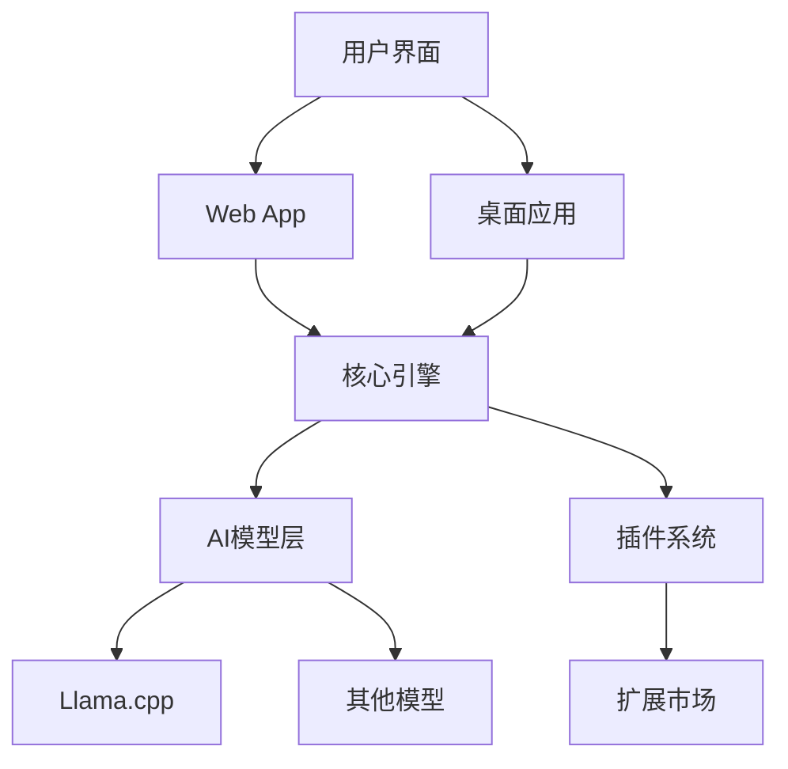

# 喵岛 Web介绍页面设计方案

## 页面整体架构

### 设计理念
- **简洁现代**: 采用极简设计风格，突出产品核心价值
- **交互友好**: 流畅的动画和交互体验
- **信息层次清晰**: 通过视觉层次引导用户注意力
- **移动优先**: 响应式设计，完美适配各种设备

## 页面结构

### 1. 导航栏 (Hero Section)
```jsx
// 主要元素
- Logo + 产品名称
- 导航菜单 (首页/功能/下载/文档/关于)
- 主题切换按钮
- 下载按钮 (突出显示)
```

**设计重点:**
- 渐变背景，营造科技感
- 大标题 + 简短描述
- 核心价值主张突出显示
- CTA按钮设计 (下载/了解更多)

### 2. 核心特性展示 (Features Section)
```jsx
// 特性卡片布局
const features = [
  {
    icon: "🤖",
    title: "AI模型支持",
    description: "支持多种主流AI模型，本地部署确保隐私安全",
    details: ["Llama.cpp集成", "模型热切换", "性能监控"]
  },
  {
    icon: "🌐",
    title: "跨平台体验",
    description: "一键运行在桌面、Web、移动端",
    details: ["Tauri桌面应用", "PWA支持", "响应式设计"]
  },
  {
    icon: "🔧",
    title: "插件扩展",
    description: "丰富的插件生态，功能无限扩展",
    details: ["插件市场", "开发者API", "自定义集成"]
  }
]
```

**设计特色:**
- 网格布局，3列响应式
- 悬停动画效果
- 图标 + 文字结合
- 渐进式信息展示

### 3. 技术架构展示 (Architecture Section)

#### 架构图设计


#### 技术栈展示
- **前端技术**: React 19, TypeScript, Tailwind CSS
- **后端技术**: Tauri (Rust), Node.js
- **AI集成**: Llama.cpp, MCP协议
- **构建工具**: Vite, Rolldown, Yarn

### 4. 下载中心 (Download Section)

#### 下载选项
```jsx
const downloadOptions = [
  {
    platform: "macOS",
    icon: "🍎",
    versions: ["Intel", "Apple Silicon"],
    size: "~150MB"
  },
  {
    platform: "Windows",
    icon: "🪟",
    versions: ["x64", "ARM64"],
    size: "~180MB"
  },
  {
    platform: "Linux",
    icon: "🐧",
    versions: ["AppImage", "deb", "rpm"],
    size: "~160MB"
  },
  {
    platform: "Web",
    icon: "🌐",
    versions: ["PWA", "浏览器版本"],
    size: "即时运行"
  }
]
```

#### 下载流程
1. 平台检测自动推荐
2. 版本选择 (稳定版/开发版)
3. 下载进度可视化
4. 安装引导

### 5. 社区和支持 (Community Section)

#### 社区板块
- **GitHub**: 项目地址，Issue跟踪，贡献指南
- **Discord**: 实时讨论，技术支持
- **文档中心**: 使用教程，API文档
- **博客**: 产品更新，技术分享

#### 贡献者展示
- 核心贡献者头像墙
- 贡献统计
- 赞助者名单

### 6. 页脚 (Footer)

#### 链接组织
```jsx
const footerLinks = {
  产品: ["下载", "功能", "更新日志"],
  开发者: ["文档", "API", "插件开发"],
  社区: ["GitHub", "Discord", "论坛"],
  公司: ["关于我们", "联系方式", "招聘"]
}
```

## 交互设计

### 动画效果
- **页面滚动**: 平滑滚动，视差效果
- **元素进入**: 渐现动画，错位出现
- **悬停交互**: 微动效果，颜色变化
- **加载状态**: 骨架屏，进度指示器

### 响应式设计
- **移动端**: 垂直布局，触摸优化
- **平板端**: 2列布局，手势支持
- **桌面端**: 3列布局，鼠标交互

## SEO优化策略

### 页面标题和描述
```html
<title>喵岛 (Miaoda) - 独立AI平台 | 本地部署，多模型支持</title>
<meta name="description" content="喵岛是一款强大的独立AI应用，支持本地模型部署，保护您的隐私安全。跨平台运行，插件扩展，打造个性化AI体验。">
```

### 结构化数据
- JSON-LD格式的产品信息
- 面包屑导航
- 网站搜索功能

### 性能优化
- 图片懒加载
- CDN资源分发
- 代码分割
- 缓存策略

## 用户体验优化

### 转化率优化
1. **清晰的价值主张**: 突出解决用户痛点
2. **社会证明**: 用户评价，下载统计
3. **风险消除**: 隐私保护说明，免费使用
4. **紧迫感**: 限时优惠，版本更新提醒

### 分析和监控
- 页面访问统计
- 用户行为追踪
- 转化漏斗分析
- A/B测试框架

## 技术实现方案

### 前端框架
- **Next.js 14**: 服务端渲染，SEO友好
- **Tailwind CSS**: 原子化CSS，开发高效
- **Framer Motion**: 动画库，交互流畅
- **TypeScript**: 类型安全，开发体验佳

### 部署方案
- **Vercel**: 全球CDN，自动部署
- **GitHub Actions**: CI/CD流程
- **监控告警**: 性能监控，错误追踪

---

*设计方案制定时间: 2025年9月10日*
*基于现代Web设计趋势和用户体验最佳实践*
